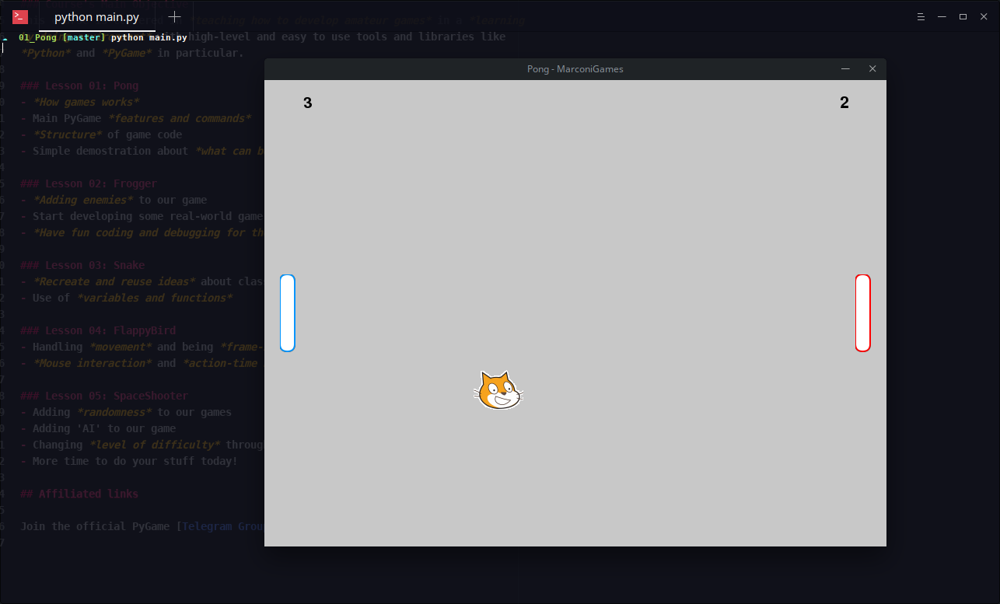
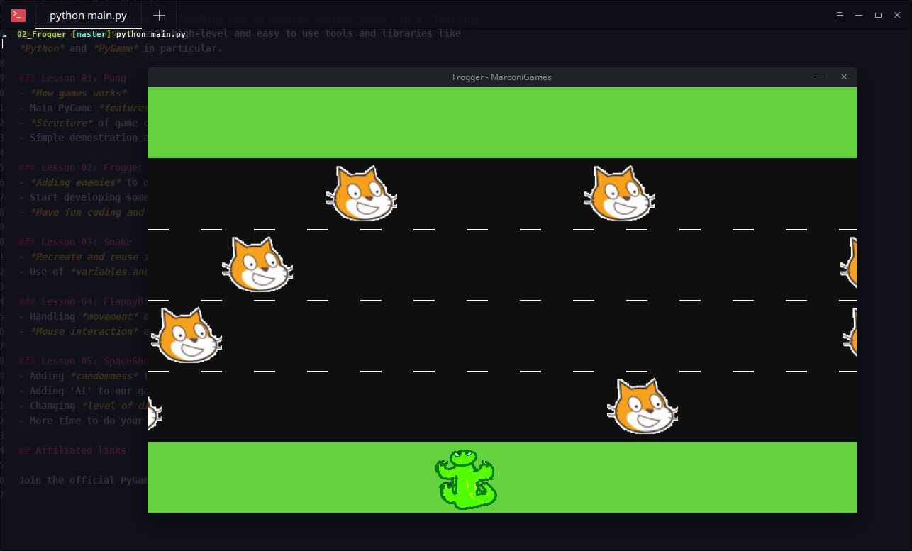
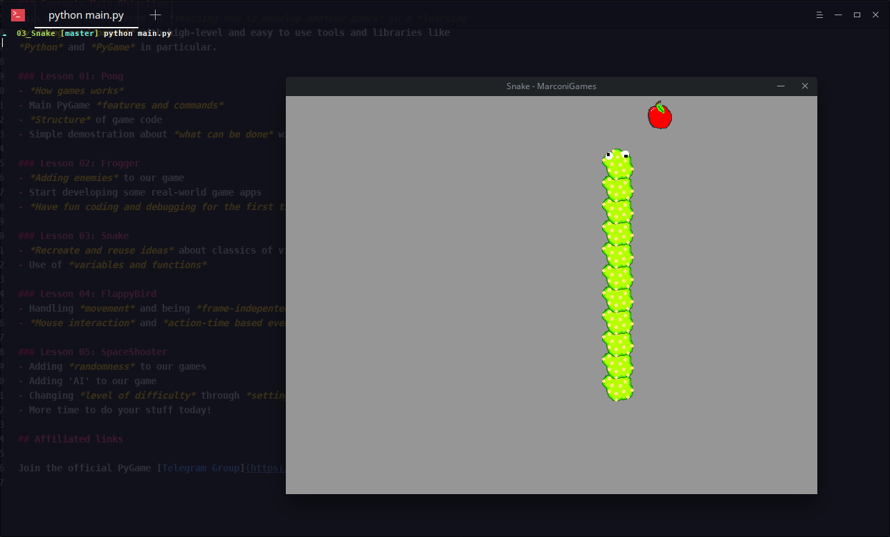

# MarconiGames
Repository for PyGame's Upcoming Course!

### Course's Main Objective
This course is centered in *teaching how to develop amateur games* in a *learning
by doing environment* with high-level and easy to use tools and libraries like
*Python* and *PyGame* in particular.

### Lesson 01: Pong
- *How games works*
- Main PyGame *features and commands*
- *Structure* of game code
- Simple demostration about *what can be done* with such simple tools in the right hands!

### Lesson 02: Frogger
- *Adding enemies* to our game
- Start developing some real-world game apps
- *Have fun coding and debugging for the first time*!

### Lesson 03: Snake
- *Recreate and reuse ideas* about classics of videogames
- Use of *variables and functions*

### Lesson 04: FlappyBird
- Handling *movement* and being *frame-indepented*
- *Mouse interaction* and *action-time based events*

### Lesson 05: SpaceShooter
- Adding *randomness* to our games
- Adding 'AI' to our game
- Changing *level of difficulty* through *settings.txt files*
- More time to do your stuff today!

## Affiliated links

Join the official PyGame [Telegram Group](https://t.me/joinchat/Bz5eoxA0Eg_7tlOkW9qHZg) if you need some help after school!
