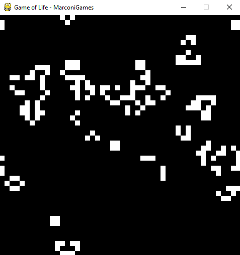

# MarconiGames
Repository for PyGame's Upcoming Course!

### Course's Main Objective
This course is centered in *teaching how to develop amateur games* in a *learning
by doing environment* with high-level and easy to use tools and libraries like
*Python* and *PyGame* in particular.

### Game 01: Pong

### Game 02: Frogger

### Game 03-06: Snake-SnakeWithJoystick

### Game 04: FlappyBird

### Game 05: SpaceShooter

### Game 07: MouseInteractions

### Game 08: ImportanceOfDeltaTime

### Game 09: UnderwaterGravity

### Game 10: GameOfLife

### Game 11: PlayerMovement

## Affiliated links

Join the official PyGame [Telegram Group](https://t.me/joinchat/Bz5eoxA0Eg_7tlOkW9qHZg) if you need some help after school!
